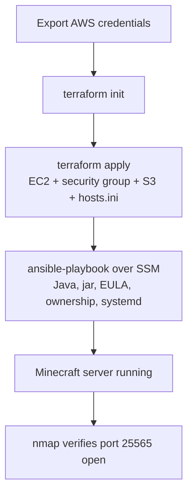

# Minecraft Server on AWS

This repo automates configuration of a Minecraft server on AWS entirely through code. The two pimary tools used to accomplish this are Terraform and Ansible. Terraform handles setting up the EC2 instance, while Ansible configures Minecraft to actually run on the server with AWS Systems Manager (SSM).

## Requirements
The following tools will need to be installed locally:
  - Terraform: >= 1.2
  - AWS CLI: v2
  - Session Manager Plugin: latest
  - Ansible: 2.19.x
  - Ansible Collections: amazon.aws (11.3.0), community.aws (11.0.0)
  - Python: 3.11+
  - nmap: 7.95
  - boto3/botocore: 1.43+

You will also need AWS credentials with sufficient permissions to create EC2, S3, and IAM resources.

## Broad Overview of Pipeline
1. AWS credentials are exported from .env file.
2. Working directory for Terraform is initialized.
3. Changes specified in .tf (terraform) files are applied. Establishes EC2 instance, security group, S3 bucket, hosts.ini file.
4. Runs Ansible playbook over SSM. Installs Java, downlaods Minecraft server jar, accepts EULA, handles file ownership, installs/enables systemd service.
5. After the EC2 instance spins up and the Minecraft server requirements are configured, nmap is used to verify.


## Tutorial
**Clone the repository:**
```
git clone https://github.com/AtticusMcNulty/Automated-Minecraft-Server.git
cd Automated-Minecraft-Server
```

**Setup AWS credentials:**
Create .env file and fill in the following with your own credentials:
```
export AWS_ACCESS_KEY_ID=your_access_key_id
export AWS_SECRET_ACCESS_KEY=your_secret_access_key
export AWS_SESSION_TOKEN=your_session_token
export AWS_DEFAULT_REGION=your_preferred_region
```
Load the credentials:
`source .env`
Confirm they're applied:
`aws configure list`

**Provision the Infrastructure**
```
terraform init
terraform apply
```

**Configure the server**
`ansible-playbook -i hosts.ini playbook.yml`
If you encounter a "worker was found in a dead state" error, set this first:
`export OBJC_DISABLE_INITIALIZE_FORK_SAFEATY=YES

**Verify the server is running**
Scan the Minecraft port:
`nmap -sV -Pn -p T:25565 <ec2_instance_public_ip>`
Output should be similar to the following:
```
PORT      STATE SERVICE   VERSION
25565/tcp open  minecraft Minecraft 1.21.5 (Protocol: 127, Message: A Minecraft Server, Users: 0/20)
```

**Connecting via Minecraft client**
Open Minecraft Java Edition. Select Multiplayer, Add Server, then enter the ec2 instance's public IP as the server address. Join and play!

**Wrap Up**
When you're done playing, remove all AWS resources to avoid additional charges:
`terraform destroy`

## Resources
Documentation used for working with AWS:
- https://aws.amazon.com/s3/
- https://docs.aws.amazon.com/cli/latest/userguide/getting-started-install.html
- https://docs.aws.amazon.com/cli/v1/userguide/cli-configure-files.html
- https://docs.aws.amazon.com/systems-manager/latest/userguide/session-manager.html
- https://docs.aws.amazon.com/systems-manager/latest/userguide/session-manager-working-with-install-plugin.html
Documentation used for working with Terraform:
- https://developer.hashicorp.com/terraform/docs
- https://developer.hashicorp.com/terraform/tutorials/aws-get-started/aws-create
- https://registry.terraform.io/providers/hashicorp/aws/latest/docs/resources/instance
- https://registry.terraform.io/providers/hashicorp/aws/latest/docs/resources/s3_bucket
Documentation used for working with Ansible:
- https://docs.ansible.com/
- https://documentation.suse.com/smart/systems-management/html/systemd-basics/index.html
- https://docs.ansible.com/projects/ansible/latest/collections/amazon/aws/aws_ssm_connection.html
